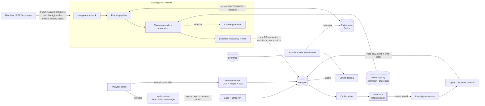

# PayGuard: real-time payment fraud platform

A production-shaped fraud and financial-crime system that makes **every payment method reviewable**:
cards, bank transfers, mobile money and crypto exchange deposits/withdrawals. All four go through one
API, one decision record, one analyst queue and one investigation agent. It is built on real data:
**590,540 card-not-present transactions** ([IEEE-CIS / Vesta](https://www.kaggle.com/c/ieee-fraud-detection)),
**203,769 Bitcoin transactions** ([Elliptic++](https://huggingface.co/datasets/AI4FinTech/ellipticpp)) and
the **OFAC SDN sanctioned-address list**.

- **Real-time scoring API.** Atomic, idempotent streaming features; a calibrated LightGBM model; an
  expected-loss decision policy; a rules engine; shadow scoring of a challenger model.
- **Payment rails** ([docs/PAYMENT_RAILS.md](docs/PAYMENT_RAILS.md)). Each rail has its own risk logic:
  - **Bank transfer:** authorised-push-payment scam and mule fan-in signals.
  - **Mobile money:** SIM-swap and cash-out signals.
  - **Crypto:** OFAC screening, an on-chain transaction model, point-in-time entity intelligence via
    address clustering, exchange typologies (pass-through, collection addresses) and the FATF Travel Rule.
  - Every decision also carries `required_actions`. For example, a crypto deposit can't be refused
    on-chain, so it's frozen instead.
- **Case management.** An analyst queue fed through a transactional outbox and an event bus.
- **Investigation agent.** Claude with read-only, point-in-time tools, and a deterministic baseline it is
  measured against.
- **Receipt verification (computer vision).** Checks proof-of-payment screenshots: OCR, then reconciliation
  against the ledger, then image forensics.
- **Operations.** Drift monitoring, Prometheus metrics, degraded mode when the feature store is down, a runbook.
- **Web console and admin dashboard** ([docs/FRONTEND.md](docs/FRONTEND.md)). A React + TypeScript single-page
  app served by the API itself: an analyst workspace (case queue, explanations, agent reports, resolution),
  a merchant scoring console, and an admin dashboard that reflects the whole system (traffic and decisions
  per rail, the queue, live precision from labels, the agent, the event pipeline, models, rules, API keys,
  audit log, component health). Role-aware: each key sees only what its API calls are allowed to serve.

## Results

Everything below is measured on **May 2018, a month the model never saw** (out-of-time test), and
regenerated from artifacts by `python -m payguard.report`. Full tables are in [docs/EVALUATION.md](docs/EVALUATION.md).

| | Result |
|---|---|
| **Model** | ROC-AUC 0.909, PR-AUC 0.527 (base rate 3.5%), 44.5% recall at 1% false-positive rate |
| **Calibration** | Expected calibration error 0.0235 → **0.0027** after isotonic calibration |
| **Money** | Policy stops **67% of fraud dollars** reviewing 3.4% of traffic: **$303k net** on the month, against $29k for hand-written rules |
| **Training/serving skew** | **0 mismatches in 12.9 million feature values** (89,326 transactions replayed through the live API and compared with the training rows) |
| **Latency** | Scoring path p50 5 ms, p95 12 ms, p99 57 ms in-process; p50 12 ms over HTTP; about 75 req/s per Python process on a laptop |
| **Drift monitor** | Healthy traffic: `ok`. Simulated upstream data bug: `alert`, names the broken signal, flag rate 3.8% → 30.5% |
| **Investigation agent** | Deterministic baseline: 86.0% accuracy against 83.0% for the model alone on the same 171 cases; 100% of report claims grounded in tool output |
| **Receipt verification** | With ledger reconciliation: 100% of 4 forgery types caught, 100% of genuine receipts verified (synthetic set). Pixel forensics alone: 33–60% |
| **Crypto transaction model** | Elliptic++, strict time-ordered split: illicit F1 0.723, precision 98%. F1 **0.87 before** a dark-market shutdown and **0.03 after**, for every model including Random Forest and graph features |
| **Crypto counterparty intelligence** | Block threshold: flags 3.9% of test transactions at 89% precision and 60% recall. Address clustering through the scored transaction's co-inputs raises sender coverage from 27.5% to 35.9% |
| **All rails, end to end** | `scripts/smoke_test.py`: 48/48 live checks. A real OFAC address is blocked on withdrawal and frozen on deposit; a real illicit Elliptic transaction is flagged and a licit one approved |

Four things the card evaluation showed that I did not expect, and what I did about each:

1. **The rules made things worse.** Model + all hand-written rules nets $264k, *less* than the model alone
   ($303k). Every heuristic rule had marginal precision below the 3.4% base fraud rate. They now run in
   shadow mode, measured but not enforced ([ADR-7](docs/DECISIONS.md)).
2. **My streaming features add almost nothing on top of the processor's signals** (ROC-AUC 0.9082 → 0.9086).
   Vesta's own columns are already velocity counts. They only pay off when no such signals exist
   (0.824 → 0.835). The value demonstrated here is the skew-free pipeline, not the features.
3. **The drift monitor alerted on healthy traffic.** Root cause: three features grew with the calendar
   because the dataset is left-censored, and the source changed its browser string format between months.
   Fixing it cost 0.004 ROC-AUC and made the monitor trustworthy ([ADR-11](docs/DECISIONS.md)).
4. **Explanations were the latency problem.** TreeSHAP cost 60–100 ms per flagged transaction, against
   1 ms to predict. It moved off the request path ([ADR-10](docs/DECISIONS.md)).

The weakest slice is transactions over $1,000 (ROC-AUC 0.755), which is where fraud dollars concentrate.
That is the next thing to fix.

And four from the crypto work:

1. **Elliptic++ wallet features leak the future.** All 55 are lifetime aggregates, identical at every
   time step, so a wallet "knows" its last-seen block at its first appearance. I don't use them.
2. **Graph structure buys very little under a strict time-ordered protocol.** A Random Forest on
   transaction features ties the graph-feature model on F1. This matches a 2026 re-evaluation showing
   that earlier GNN gains came from test-period graph leakage.
3. **No model survives the dark-market shutdown** (F1 0.87 → 0.03). That is the argument for the
   controls that don't depend on the model: sanctions screening, entity attribution, human review and
   fast retraining.
4. **Address-level history is weak on Bitcoin** because addresses are rarely reused. Entity resolution
   through the scored transaction's co-inputs is what makes attribution carry over, which is how
   commercial KYT systems use the common-input heuristic.

## Architecture



**The idea that holds it together:** the offline backfill replays the event log through **the same
`FeaturePipeline` the API calls**. Training rows are point-in-time correct by construction, and
`payguard parity` proves the live API reproduces them exactly.

| Concern | How it's handled | Where |
|---|---|---|
| Training/serving skew | One feature code path; parity audit on replayed traffic | `features/pipeline.py`, `simulate.py` |
| Retries and double counting | Idempotency on `transaction_id` (409 on changed payload); feature-store dedupe key | `services/scoring.py`, `features/store.py` |
| Concurrent updates to one card | Optimistic `WATCH`/`MULTI` transactions with retry | `features/store.py` |
| Out-of-order events | Commutative decayed aggregates (property-tested) | `features/state.py` |
| Lost or phantom events | Transactional outbox, at-least-once delivery, idempotent consumers | `events.py`, `workers.py` |
| Feature store outage | Degraded scoring on request data, `degraded` flag, `/readyz` 503 | `services/scoring.py` |
| Bad model release | Immutable versions, champion/challenger, shadow scoring, hot-swap promotion and rollback | `models/registry.py` |
| Decision quality | Isotonic calibration, expected-loss policy under analyst capacity | `models/policy.py` |
| Rule sprawl | Rules measured by marginal precision; losers run in shadow | `configs/rules.yaml` |
| Model decay | PSI drift monitor against the validation reference; live precision from labels | `monitoring.py` |
| Agent safety | Read-only tools, no label leakage, sanitised untrusted text, grounded citations | `agent/` |
| Abuse | Hashed API keys, roles, token-bucket rate limits (Redis-backed for multiple replicas) | `api/security.py` |

Design rationale and trade-offs: [docs/DECISIONS.md](docs/DECISIONS.md).
All numbers: [docs/EVALUATION.md](docs/EVALUATION.md). Operations: [docs/RUNBOOK.md](docs/RUNBOOK.md).

## Quick start

```bash
python -m venv .venv && .venv/Scripts/activate        # or source .venv/bin/activate
pip install -e ".[vision,dev]"

payguard ingest        # download from the HF mirror, sha256-verify, normalise to Parquet (~2 min)
payguard backfill      # offline features via the serving code, plus online snapshot (~6 min)
payguard train         # train, calibrate, fit policy, evaluate, register (~10 min with ablations)
payguard crypto-ingest # Elliptic++ + OFAC SDN addresses (~1 GB)
payguard crypto-train  # on-chain transaction model, strict time-ordered evaluation (~9 min)
payguard crypto-intel  # address/entity intelligence store + counterparty-risk combiner (~5 min)

payguard create-client --name shop --role merchant    # prints an API key (shown once)
payguard create-client --name ops  --role analyst
payguard create-client --name me   --role admin
cd frontend && npm ci && npm run build && cd ..        # web console -> frontend/dist
payguard serve                                         # console at http://127.0.0.1:8000, API docs at /docs
```

Console development with hot reload: `cd frontend && npm run dev` (port 5173, proxies `/v1` to the API on
8000). One-command deploy: `docker build -t payguard .` builds the console and the API into one image.

```bash
curl -s localhost:8000/v1/transactions/score -H "Authorization: Bearer $KEY" -H "Content-Type: application/json" -d '{
  "transaction_id": "demo-1", "event_time": "2018-05-02T10:00:00Z", "amount": 950.0, "product_code": "C",
  "card": {"bin": "9500", "issuer": "111", "country_code": "150", "category_code": "226", "network": "visa", "type": "debit"},
  "billing": {"region": "299", "country": "87"}, "payer_email_domain": "gmail.com",
  "device": {"type": "mobile", "info": "iOS Device", "os": "iOS 11.2.1", "browser": "mobile safari 11.0", "screen": "2436x1125"},
  "signals": {"C1": 3, "C13": 1, "C14": 1, "D1": 0}
}'
```

Reproduce the evaluation:

```bash
payguard replay            # score the May test month through the real service; delayed labels
payguard parity            # training/serving skew audit
payguard agent-eval --n 200 --provider heuristic   # or --provider claude with ANTHROPIC_API_KEY set
payguard vision-eval
payguard drift-demo
payguard loadtest --key $KEY --n 2000 --concurrency 4 --label "API only"   # against a running `payguard serve`
python -m payguard.report  # regenerates docs/EVALUATION.md from artifacts/
pytest                     # 50 tests (-m "not slow" skips the OCR test)
cd frontend && npm test && npm run typecheck   # console unit tests + strict TypeScript
```

`run_all.sh` runs backfill, train, replay, parity, the agent eval and the drift drill in one go (about 40
minutes on a laptop).

End-to-end check of **every HTTP endpoint** against a running server, using 600 real test-month
transactions as sample data, plus real OFAC addresses and real Elliptic transactions for crypto. It runs 48
checks: auth and roles, validation, scoring, idempotency, cases, explanations, receipts, the agent, feedback,
every payment rail, drift, the registry and metrics.

```bash
payguard serve --port 8020        # after creating merchant, analyst and admin keys with create-client
python scripts/smoke_test.py --url http://127.0.0.1:8020 --merchant-key $M --analyst-key $A --admin-key $ADM
```

Full stack (Postgres, Redis and separate worker processes): `docker compose up` (see the header of
`docker-compose.yml`).

## API

Every route is versioned under `/v1`, declares a typed response model (complete OpenAPI at `/docs`), is
role-gated, and returns errors in one envelope: `{"error": {"code", "message", "request_id", "details?"}}`,
where `request_id` matches the `x-request-id` header and the logs. Lists are paginated
(`{items, total, limit, offset}`) and filterable.

| Method | Path | Role | Purpose |
|---|---|---|---|
| GET | `/v1/auth/me` | any | Identity, role and permissions of the calling key (the console's login) |
| POST | `/v1/payments/score` | merchant | Any rail (`rail`: card, bank_transfer, mobile_money, crypto): decision, risk, reasons, `required_actions` (idempotent) |
| POST | `/v1/transactions/score` | merchant | Card-only endpoint (same pipeline), kept for compatibility |
| GET | `/v1/transactions` | analyst | Paginated; filter by rail, decision, label, id prefix, time, amount, client |
| GET | `/v1/transactions/{id}` | analyst | Payload, decision, shadow score, label, case |
| GET | `/v1/cases` | analyst | Queue ordered by expected loss; filter by status, rail, decision, resolution |
| GET | `/v1/cases/{id}` | analyst | Case, payload, decision, explanation, investigations, receipts |
| POST | `/v1/cases/{id}/resolve` | analyst | Analyst decision; records the label; audited |
| POST | `/v1/cases/{id}/investigate` | analyst | Run the agent on the interactive lane (outbox event `investigation.requested`) |
| GET | `/v1/investigations`, `/v1/investigations/{id}?include_trace=true` | analyst | Reports, and the full tool trace |
| GET / POST | `/v1/labels` | analyst | List labels / bulk delayed labels (chargeback feed) |
| POST | `/v1/receipts/verify` | merchant, analyst | Proof-of-payment screenshot verification (optionally attached to a case) |
| GET | `/v1/receipts`, `/v1/receipts/{id}` | analyst | Verified receipts and full results |
| GET | `/v1/monitoring/drift` | analyst | PSI drift report |
| GET | `/v1/models`, `/v1/models/{version}` | admin | Registry and a version's training metadata and evaluation |
| POST | `/v1/models/promote` | admin | Champion/challenger promotion (hot swap); audited |
| GET | `/v1/admin/overview` | admin | Whole-system KPIs for a time window (`window`, `anchor`, `from`/`to`) |
| GET | `/v1/admin/timeseries` | admin | Decisions and amounts per hour/day, overall and per rail |
| GET | `/v1/admin/rails`, `/v1/admin/rules` | admin | Rail configuration and traffic; every rule with mode and hit counts |
| GET | `/v1/admin/events` | admin | Outbox backlog per topic and recent events |
| GET / POST | `/v1/admin/clients`, `/v1/admin/clients/{id}/revoke` | admin | API keys: list, issue (shown once), revoke (immediate); audited |
| GET | `/v1/admin/audit`, `/v1/admin/system` | admin | Audit log; components, health and non-secret settings |
| GET | `/healthz`, `/readyz`, `/metrics` | - | Liveness, readiness (DB, store, model), Prometheus |

## Repository layout

```
src/payguard/
  data/        ingest (download + verify), adapter (IEEE row -> canonical schema), out-of-time splits
  features/    decayed-aggregate state, online stores (memory / Redis), card pipeline, rail entities, backfill
  models/      encoder, training + evaluation, calibration, expected-loss policy, registry
  services/    scoring service (shared request path), per-rail scorers, async TreeSHAP explanations,
               queries.py (read models), admin.py (dashboard aggregates), audit.py
  api/         FastAPI app factory, routers/ (one per resource), dto.py (response models), errors.py
               (error envelope), deps.py (auth, roles, pagination), security.py (keys + rate limiting)
  agent/       investigation tools (rail-aware), Claude + heuristic providers, evaluation harness
  crypto/      Elliptic++ ingest, transaction risk model, OFAC screening, entity clustering, address intelligence
  vision/      receipt rendering/forgery (evaluation), OCR + ledger + ELA verifier, evaluation
  events.py    outbox + event bus        workers.py   relay + investigation consumer
  rules.py     declarative rules          monitoring.py  PSI drift
  simulate.py  replay, parity, load test, drift drill
frontend/      web console: React + TypeScript + Vite (src/api typed client, src/features one folder per page)
scripts/       smoke_test.py: end-to-end check of every endpoint with real sample transactions
configs/       rules.yaml, policy.yaml, prometheus.yml, rails/{bank_transfer,mobile_money,crypto}.yaml
docs/          DECISIONS.md, EVALUATION.md (generated), RUNBOOK.md, PAYMENT_RAILS.md, FRONTEND.md
tests/         50 tests: admin API + error envelope + console serving, feature math + stationarity, store parity, API contracts, concurrency, agent loop + safety,
               vision, every payment rail (sanctions, mule fan-in, SIM swap, pass-through, Travel Rule)
```

## Honest limitations

- **The console signs in with API keys, not SSO.** Keys live in `sessionStorage` under a strict CSP; a
  production deployment for a bank would put OIDC SSO with short-lived sessions in front (see
  [docs/FRONTEND.md](docs/FRONTEND.md)).

- **The non-card rails have no labelled training data.** Bank transfer and mobile money run transparent
  scorecards whose points are research-based priors (in YAML, each with its reason). They are not fitted
  weights. Analyst resolutions and chargebacks feed the labels table that a trained model will need.
- **The crypto data is Bitcoin from 2016-17.** On-chain intelligence (the transaction model and address
  clustering) exists only for Bitcoin. Account-based chains (Ethereum, Tron) need different entity
  resolution, so on them the crypto rail runs sanctions screening, the behavioural scorecard and the
  Travel Rule, and labels its model version accordingly. Exposure is one hop and count-based, not
  multi-hop value-weighted tracing.
- **Exchange-behaviour typologies are tested on constructed scenarios.** Pass-through, collection
  addresses and new-account withdrawals are checked in `tests/test_rails.py`, not on a real exchange
  ledger. There is no public labelled one.

- **The data is real, but the setting is e-commerce cards in 2017-18.** It is not Nigerian mobile money.
  The schema and policy are generic, and the receipt-verification module targets the fake-transfer-alert
  fraud common with Nigerian merchants, but the model numbers describe IEEE-CIS only.
- **Entity keys are proxies.** IEEE-CIS has no card or device IDs. `customer` = card profile + billing
  region + email, and `device` is a coarse fingerprint (see `features/pipeline.py`).
- **The vision evaluation is synthetic** (generated receipts from fictional banks), because no public
  labelled forgery set exists. Ledger reconciliation carries the real guarantee.
- **Labels in the replay arrive with a simulated delay** (exponential, mean 5 days). Real chargeback
  windows are longer.
- **The Claude agent has not been run against the live API.** No API key was available when this was built.
  The agent numbers are for the deterministic provider. The Claude tool loop is tested against a scripted
  client (`tests/test_claude_loop.py`), and `payguard agent-eval --provider claude` runs the same evaluation
  once a key is set. Whether an LLM beats the deterministic baseline is an open question this repo is set
  up to answer, not one it has answered.
- **Numbers were measured on a 4-core laptop with SQLite.** One Python process saturates at about 75
  requests/s. The Docker/Postgres/Redis topology is provided but was not run in this environment (no Docker
  available), so multi-process scaling is untested. The Redis code paths are tested against `fakeredis`.
- **The money figures rest on stated assumptions:** analysts confirm the fraud they review, a review costs
  $5, and a false decline costs 10% of the amount.
